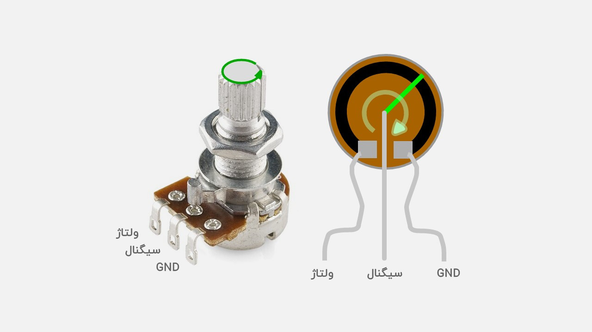

# Project 03 — Potentiometer Controlled LED Brightness

## 1. What Are We Building?

In this project, we will use a potentiometer to control the brightness of an LED.

As the potentiometer knob is rotated, the LED will smoothly change from completely OFF to fully ON.

This project is important because it connects:

* An **analog input** (the potentiometer)
* A **PWM output** (the LED)

It is one of the first examples of a complete sensing-and-control system using Arduino.

---

## 2. What Will You Learn?

By the end of this project you will be able to:

* Read analog sensor values using `analogRead()`
* Understand how PWM simulates analog output
* Use `analogWrite()` to control LED brightness
* Convert values from one range to another using `map()`
* Understand the relationship between input and output signals
* Build a simple closed-loop style interaction between hardware components
* Use constants and variables to write cleaner code

---

## 3. Components Needed

| Quantity | Component                         |
| -------- | --------------------------------- |
| 1        | Arduino Uno                       |
| 1        | Potentiometer (10 kΩ recommended) |
| 1        | LED                               |
| 1        | 220 Ω resistor                    |
| 1        | Breadboard                        |
| 5        | Jumper wires                      |
| 1        | USB cable                         |



---

## 4. Key Concepts

### 4.1 Analog Input

The potentiometer produces a voltage between:

```text
0 V  → knob fully left
5 V  → knob fully right
```

Arduino measures this voltage and converts it into a number:

```text
0 V → 0
5 V → 1023
```

This conversion is performed by the built-in Analog-to-Digital Converter (ADC).

The Arduino Uno uses a 10-bit ADC:

```text
2^10 = 1024 levels
```

Resulting range:

```text
0 to 1023
```

---

### 4.2 PWM (Pulse Width Modulation)

Arduino Uno cannot generate a true analog voltage on most pins.

Instead, it rapidly switches a digital pin ON and OFF.

This technique is called:

**Pulse Width Modulation (PWM)**

A PWM signal is characterized by its:

* Frequency
* Duty Cycle

The duty cycle determines how bright the LED appears.

| Duty Cycle | LED Brightness |
| ---------- | -------------- |
| 0%         | Off            |
| 25%        | Dim            |
| 50%        | Medium         |
| 75%        | Bright         |
| 100%       | Fully Bright   |

---

### 4.3 PWM Pins on Arduino Uno

PWM-capable pins are marked with a `~` symbol:

```text
3
5
6
9
10
11
```

For this project we will use:

```text
Pin 9
```

---

### 4.4 The map() Function

The potentiometer produces values:

```text
0 → 1023
```

But PWM expects:

```text
0 → 255
```

We therefore convert one range into another:

```cpp
map(value, 0, 1023, 0, 255);
```

Meaning:

```text
0      becomes 0
1023   becomes 255
512    becomes approximately 127
```

---

## 5. Hardware Setup

### Potentiometer Connections

| Potentiometer Pin | Arduino |
| ----------------- | ------- |
| Left              | GND     |
| Middle            | A0      |
| Right             | 5V      |

### LED Connections

| LED Terminal | Connection           |
| ------------ | -------------------- |
| Anode (+)    | Pin 9                |
| Cathode (-)  | 220 Ω resistor → GND |

---

## 6. The Code

### Version 1 — Basic

```cpp
void setup() {
}

void loop() {

  int value = analogRead(A0);

  int brightness = map(value, 0, 1023, 0, 255);

  analogWrite(9, brightness);
}
```

---


---

### Version 2 — Best

```cpp
const int POT_PIN = A0;
const int LED_PIN = 9;

void setup() {

  pinMode(LED_PIN, OUTPUT);

  Serial.begin(9600);
}

void loop() {

  int potValue = analogRead(POT_PIN);

  int brightness = map(potValue, 0, 1023, 0, 255);

  analogWrite(LED_PIN, brightness);

  Serial.print("Potentiometer: ");
  Serial.print(potValue);

  Serial.print("    Brightness: ");
  Serial.println(brightness);

  delay(20);
}
```

---

## 7. How the Program Works

```text
Program starts
      │
      ▼
┌───────────────┐
│   setup()     │
│               │
│ Serial.begin  │
│ pinMode()     │
└───────┬───────┘
        │
        ▼
┌───────────────────────────────┐
│            loop()             │
│                               │
│ Read potentiometer (A0)       │
│            ↓                  │
│ Convert 0–1023 to 0–255       │
│            ↓                  │
│ analogWrite() to LED          │
│            ↓                  │
│ LED brightness changes        │
│            ↓                  │
│ Print values to Serial Monitor│
└────────────┬──────────────────┘
             │
             └────► Repeat forever
```

---

## 8. Expected Behavior

| Potentiometer Position | ADC Value | PWM Value | LED                |
| ---------------------- | --------- | --------- | ------------------ |
| Fully Left             | 0         | 0         | Off                |
| 25%                    | ~256      | ~64       | Dim                |
| 50%                    | ~512      | ~127      | Medium             |
| 75%                    | ~768      | ~191      | Bright             |
| Fully Right            | 1023      | 255       | Maximum Brightness |

---


Many real systems work exactly the same way:

* Temperature controller
* Motor speed controller
* Robotic joints
* Industrial automation systems
* Flight control systems

The only difference is the complexity of the sensor and actuator.

---

## 9. Exercises & Challenges

### Exercise 1 — Reverse Control ⭐⭐

Modify the program so that:

```text
Knob Left  → Bright LED
Knob Right → Dim LED
```


---

### Exercise 2 — Serial Monitor Analyzer ⭐⭐

Print:

* ADC value
* PWM value
* Percentage of brightness

Example:

```text
ADC: 512
PWM: 127
Brightness: 50%
```

---

### Exercise 3 — Dual LED Controller ⭐⭐⭐

Add a second LED.

Requirements:

* LED1 gets brighter as the knob turns right.
* LED2 gets dimmer as the knob turns right.

This creates an inverse relationship between the two LEDs.

---

### Exercise 4 — Software Dimmer ⭐⭐⭐

Remove the potentiometer completely.

Use a variable and gradually increase and decrease the LED brightness automatically.

Create a smooth fading effect.

```

The famous Arduino "Fade" example uses the same PWM principle.
```
---
### Exercise 5 — LED Bar Graph ⭐⭐⭐⭐

Create a simple LED level indicator using four LEDs.

#### Components Needed

| Quantity | Component |
|----------|-----------|
| 4 | LEDs |
| 4 | 220 Ω Resistors |

#### Connections

| LED | Arduino Pin |
|------|-------------|
| LED 1 | 8 |
| LED 2 | 9 |
| LED 3 | 10 |
| LED 4 | 11 |

#### Goal

The potentiometer value should determine how many LEDs are ON.

| Potentiometer Value | LEDs ON |
|---------------------|----------|
| 0 – 255 | LED1 |
| 256 – 511 | LED1 + LED2 |
| 512 – 767 | LED1 + LED2 + LED3 |
| 768 – 1023 | LED1 + LED2 + LED3 + LED4 |

his principle is commonly used in:

- Battery charge indicators
- Audio level meters
- Fuel level indicators
- Industrial monitoring panels
- Power bank charge displays
