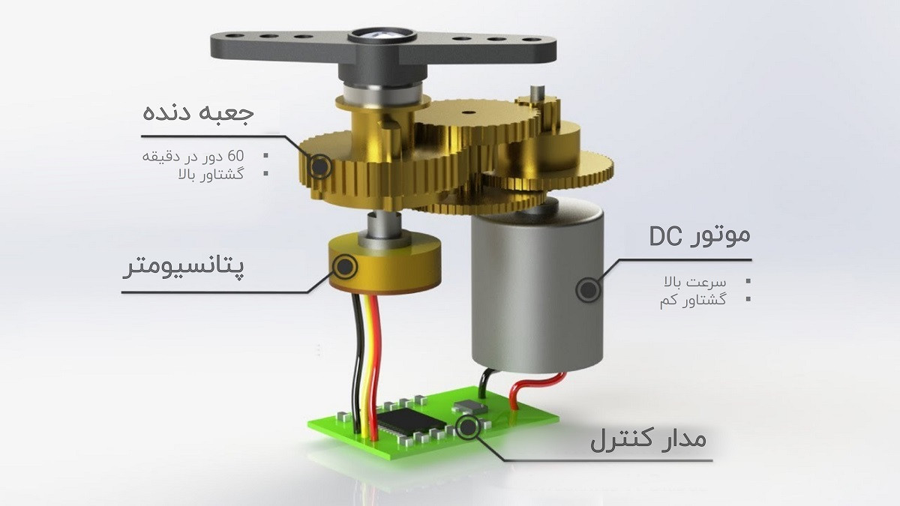

# Project 03 — Servo Motor: Controlling Position with Code

*Servo* motors are a special type of motor that don’t spin around in a circle, but 
move to a specific position and stay there until you tell them to move again. 
Servos usually only rotate 180 degrees (one half of a circle). 

Similar to the way you used pulses to PWM an LED in the Color Mixing Lamp Project, 
servo motors expect a number of pulses that tell them what angle to move to. The 
pulses always come at the same time intervals, but the width varies between 1000 
and 2000 microseconds. While it’s possible to write code to generate these pulses, 
the Arduino software comes with a library that allows you to easily control the motor


## Schematics



## 1. What Are We Building?

We will connect a **servo motor** to the Arduino and control its exact angle using code.
First we will sweep it slowly from **0° to 180° and back**, then we will make it jump
to specific positions on command.

Unlike the LED in Project 01 (which was either ON or OFF), a servo motor can be
told to move to **any angle** between 0° and 180°. This is our first experience with
**precise, analog-style control** of a physical mechanism.

---

## 2. What Will You Learn?

By the end of this project you will be able to:

- Explain what a servo motor is and how it differs from a regular DC motor
- Use the built-in **Servo library** and understand why libraries exist
- Use `#include` to add a library to your sketch
- Create and use a **library object** (`Servo myServo`)
- Call **object methods**: `.attach()`, `.write()`, `.read()`
- Use a **`for` loop** to repeat an action a set number of times
- Understand **PWM (Pulse Width Modulation)** at a beginner level

---

## 3. Components Needed

| Quantity | Component | Notes |
|----------|-----------|-------|
| 1 | Arduino Uno | Any compatible clone |
| 1 | Servo motor (SG90 or MG90S) | SG90 is the most common beginner servo |
| 3 | Jumper wires (male-to-male) | Red, black, and yellow recommended |
| 1 | USB cable | To connect Arduino to computer |
| 1 | External 5V power supply *(optional)* | Needed only if using 2+ servos |

> **No resistor needed!**  
> Unlike LEDs, servo motors have built-in control electronics.
> They connect directly to power, ground, and a signal pin.

### Servo Motor Wire Colors

| Wire Color | Connection | Purpose |
|------------|------------|---------|
| **Brown** or Black | GND | Ground |
| **Red** | 5V | Power |
| **Orange** or Yellow or White | Signal pin (e.g., pin 9) | Control signal |

> ⚠️ **Wire colors vary by brand.** Always check the datasheet for your specific servo.
> The signal wire is always the one that is NOT red or black/brown.

---

## 4. Key Concepts

### 4.1 What Is a Servo Motor?

A servo motor is a motor that can be commanded to rotate to a **specific angle and hold
that position**. Inside the servo there are three things:

1. A small **DC motor** that actually spins
2. A set of **gears** that slow the motor down and increase torque
3. A **control circuit** that reads the signal from Arduino and moves to the right angle

This is fundamentally different from a regular DC motor, which just spins continuously.
A servo says: *"Go to exactly 90° and stay there."*

**Common uses:** robot arms, RC car steering, camera gimbals, door locks, animatronics.

### 4.2 How Does a Servo Know Its Angle? — PWM

Arduino communicates with the servo using **PWM (Pulse Width Modulation)**.
PWM sends a rapid series of ON/OFF pulses on the signal wire. The **width** (duration)
of each pulse tells the servo where to go:

```
Pulse width  →  Angle
  ~1.0 ms    →    0°
  ~1.5 ms    →   90°  (center)
  ~2.0 ms   →  180°
```

These pulses repeat about **50 times per second** (50 Hz).

> **You do not need to calculate pulse widths yourself.**  
> The Servo library handles all of this. You simply write `.write(90)` and the
> library figures out the correct pulse width automatically.

### 4.3 Libraries

A **library** is a collection of pre-written code that someone else built for you.
Instead of writing complex PWM timing code yourself, you use the **Servo library**
which is already included with Arduino IDE.

Think of a library like a power tool — you do not need to know how the motor inside
it works. You just plug it in and press the button.

```cpp
#include <Servo.h>    // "Include" = add this library to my sketch
```

The `#include` line must be at the very **top** of your sketch, before everything else.

### 4.4 Objects and Methods

The Servo library uses a programming concept called an **object**.

```cpp
Servo myServo;        // Creates a servo object named "myServo"
```

Think of an object as a variable that not only **stores data** but also **knows how
to do things**. Those things it can do are called **methods**.

You call a method using a dot (`.`):

```cpp
myServo.attach(9);    // Tell myServo: "your signal wire is on pin 9"
myServo.write(90);    // Tell myServo: "go to 90 degrees"
myServo.read();       // Ask myServo: "what angle are you at right now?"
```

| Method | What It Does |
|--------|-------------|
| `.attach(pin)` | Links this servo object to a physical pin |
| `.write(angle)` | Moves the servo to an angle (0–180) |
| `.read()` | Returns the last angle that was written |

> **Naming:** `myServo` is just the name we chose. You could name it `doorServo`,
> `armServo`, or anything else. The name helps explain what the servo does in
> your project.

### 4.5 The `for` Loop

A `for` loop repeats a block of code a **specific number of times**, automatically
counting for you.

```cpp
for (int angle = 0; angle <= 180; angle++) {
  myServo.write(angle);
  delay(15);
}
```


---

## 5. Hardware Setup

### Circuit Description

```
Arduino               Servo Motor
─────────                ──────────
  Pin 9   ──────────── Signal (Orange/Yellow/White)
  5V      ──────────── Power  (Red)
  GND     ──────────── Ground (Brown/Black)
```


### Which Pin to Use?

Pin 9 is a **PWM-capable pin**. On Arduino Uno, PWM pins are marked with a tilde
symbol (**~**): pins 3, 5, 6, 9, 10, and 11.

> The Servo library can technically use any digital pin, but using a PWM pin
> is best practice and guarantees compatibility.

### Decoupling Capacitor (Recommended)

When a servo motor starts moving, it briefly draws a large burst of current. This causes
a sudden **voltage dip** on the board, which can make other components behave
unpredictably (flickering LEDs, sensor glitches, unexpected resets).

To prevent this, place a **100 µF electrolytic capacitor** across the **5V and GND**
pins right next to where the servo power wires connect:

```
5V  ──┬──── Servo Red wire
      │
     [100µF]   ← decoupling capacitor
      │
GND ──┴──── Servo Brown/Black wire
```

These are called **decoupling capacitors** because they *decouple* (isolate) voltage
changes caused by one component from affecting the rest of the circuit. They act like
a small local energy reservoir — they absorb the sudden demand so the main supply
doesn't dip.

> ⚠️ **SAFETY — Read carefully:**  
> Electrolytic capacitors are **polarized** — they must be connected the right way around.  
> - The **anode (+)** longer leg → connect to **5V**  
> - The **cathode (–)** shorter leg, marked with a **black stripe** → connect to **GND**  
>
> **If you insert the capacitor backwards, it can overheat and explode.**  
> Always double-check the stripe and leg length before powering on.

### Power Warning for Multiple Servos

A single small servo (SG90) draws about **200–500 mA** of current. The Arduino 5V
pin can supply around **400–500 mA** total. If you connect **two or more servos**,
use an external 5V power supply connected directly to the servo power wires.
Always share a common **GND** between Arduino and the external supply.

---

## 6. The Code

### Version 1 — Sweep (Back and Forth)

```cpp
#include <Servo.h>              // Include the Servo library

const int SERVO_PIN = 9;        // Signal wire connected to pin 9

Servo myServo;                  // Create a Servo object

void setup() {
  myServo.attach(SERVO_PIN);    // Attach the servo to pin 9
}

void loop() {
  // Sweep from 0° to 180°
  for (int angle = 0; angle <= 180; angle++) {
    myServo.write(angle);
    delay(15);                  // Wait 15 ms between each degree
  }

  // Sweep from 180° back to 0°
  for (int angle = 180; angle >= 0; angle--) {
    myServo.write(angle);
    delay(15);
  }
}
```

---

### Version 2 — Jump to Specific Positions

```cpp
#include <Servo.h>

const int SERVO_PIN = 9;

Servo myServo;

void setup() {
  myServo.attach(SERVO_PIN);
}

void loop() {
  myServo.write(0);      // Move to 0° (fully left)
  delay(1000);

  myServo.write(90);     // Move to 90° (center)
  delay(1000);

  myServo.write(180);    // Move to 180° (fully right)
  delay(1000);

  myServo.write(90);     // Return to center
  delay(1000);
}
```

---

### Version 3 — Button-Controlled Servo *(uses Project 02 knowledge)*

```cpp
#include <Servo.h>

const int SERVO_PIN  = 9;
const int BUTTON_PIN = 2;

Servo myServo;

void setup() {
  myServo.attach(SERVO_PIN);
  pinMode(BUTTON_PIN, INPUT_PULLUP);  // Built-in pull-up resistor
}

void loop() {
  int buttonState = digitalRead(BUTTON_PIN);

  if (buttonState == LOW) {       // Button pressed (INPUT_PULLUP: LOW = pressed)
    myServo.write(180);
  } else {                        // Button not pressed
    myServo.write(0);
  }
}
```

> This version shows how projects build on each other: we combine what we learned
> about buttons (Project 02) with the new servo control.

---

### Why `delay(15)` in the Sweep?

The servo needs time to physically move from one angle to the next.
If you use `delay(0)` or no delay, the code sends angles faster than the motor
can follow, and the sweep will look jerky or skip positions entirely.

15 ms per degree × 180 degrees = 2700 ms ≈ **2.7 seconds** for a full sweep.
Try `delay(5)` for a fast sweep or `delay(50)` for a very slow sweep.

---

## 8. Exercises & Challenges


### Bonus Challenge — Pendulum ⭐⭐⭐

Make the servo behave like a swinging pendulum with **easing**:
- It accelerates from the center outward (small delay → large delay)
- It decelerates as it reaches the end (large delay → small delay)

*Hint: The delay value should be proportional to how close the angle is to the
center (90°).*

---

