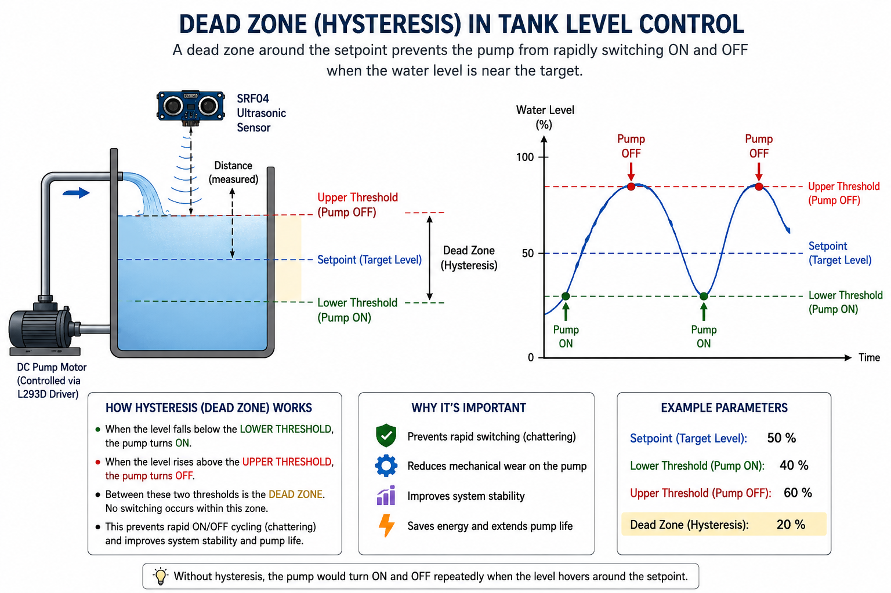

# Project 08 — Water Tank Level Control: Ultrasonic Sensor & DC Motor


## 1. What Are We Building?

We will build an **automatic water tank level controller** — the same type of system
used in building water towers, irrigation tanks, and industrial reservoirs.

An **SRF04 ultrasonic sensor** measures the distance from the top of the tank to the
water surface. From this, Arduino calculates the current water level. A **DC motor
(pump)** — controlled through an **L293D motor driver** — is turned on when the level
is too low and turned off when it reaches the target level.

The key engineering feature is **hysteresis control**: a small "dead zone" around the
target level that prevents the pump from rapidly switching on and off (chattering) when
the water surface is near the setpoint — exactly the same technique used in real
industrial level controllers.

---

## 2. What Will You Learn?

By the end of this project you will be able to:

- Explain how an **ultrasonic distance sensor** works using the speed of sound
- Use `pulseIn()` to measure the width of a pulse in microseconds
- Use `delayMicroseconds()` for precise, sub-millisecond timing
- Understand what an **H-bridge motor driver** (L293D) is and why it is needed
- Control a DC motor's **speed** (PWM via `analogWrite()`) and **direction** (IN1/IN2 pins)
- Explain **hysteresis** (dead-band control) and why it is essential in real systems
- Use `constrain()` to clamp sensor readings to a valid physical range
- Understand the difference between **on/off (bang-bang) control** and a future step
  toward proportional (PID) control

---

## 3. Components Needed

| Quantity | Component | Notes |
|----------|-----------|-------|
| 1 | Arduino Uno | Any compatible clone |
| 1 | SRF04 Ultrasonic Distance Sensor | 4-pin: VCC, GND, TRIG, ECHO |
| 1 | L293D Motor Driver IC | DIP-16 package; mounts on breadboard |
| 1 | DC Motor | Represents the water pump |
| 1 | External power supply (6–12 V) | Powers the motor through L293D |
| 1 | Breadboard | Full-size recommended for L293D |
| Several | Jumper wires | |
| 1 | USB cable | |

### SRF04 vs HC-SR04 — What Is the Difference?

Both sensors work on the same principle and use the same code. Common differences:

| Feature | SRF04 | HC-SR04 |
|---------|-------|---------|
| Manufacturer | Devantech (UK) | Various (China) |
| Supply voltage | 5V | 5V |
| Trigger pulse | 10 µs HIGH | 10 µs HIGH |
| Echo output | 5V logic | 5V logic |
| Range | 3 cm – 3 m | 2 cm – 4 m |
| Connector | 4-pin header | 4-pin header |

> [!CAUTION]
> The code is **identical** for both sensors. Pin names (TRIG, ECHO) are the same.

---

## 4. Key Concepts

### 4.1 How Ultrasonic Distance Sensing Works

The SRF04 measures distance using the **speed of sound**, the same way bats navigate.

[](https://www.youtube.com/watch?v=iwD9RiqIHQw)

**Step-by-step:**

```
1. Arduino pulls TRIG HIGH for 10 µs → sensor emits a burst of 8 ultrasonic pulses at 40 kHz
2. Sensor pulls ECHO HIGH
3. Ultrasonic pulses travel through air, hit the water surface, and reflect back
4. When the echo returns, sensor pulls ECHO LOW
5. Arduino measures how long ECHO was HIGH (using pulseIn)
6. Distance = (time × speed of sound) / 2
```

The division by 2 is because the sound travels **to** the surface and **back** —
the round-trip distance is twice the actual distance.

**Speed of sound in air at room temperature:** approximately **343 m/s = 0.0343 cm/µs**

```
distance (cm) = duration (µs) × 0.034 / 2
```

### 4.2 `pulseIn()` — Measuring Pulse Duration

`pulseIn(pin, state)` waits for a pulse to start on a pin, measures how long it
lasts, and returns the duration in **microseconds (µs)**:

```cpp
long duration = pulseIn(echoPin, HIGH);
// duration is in microseconds (µs), not milliseconds
```

| Parameter | Meaning |
|-----------|---------|
| `pin` | Which pin to listen on |
| `HIGH` | Wait for the pin to go HIGH, then measure until it goes LOW |
| Return value | Duration in microseconds (µs) as a `long` |

>[!NOTE] 
**Why `long` and not `int`?**  
> An `int` on Arduino holds values up to ~32,767. A 3-meter echo takes ~17,500 µs —
> already close to the limit. `long` holds up to ~2,147,000,000, making it safe
> for any realistic distance. Always use `long` for `pulseIn()` results.

### 4.3 `delayMicroseconds()` — Sub-Millisecond Timing

The trigger pulse for the SRF04 must be **exactly 10 microseconds** — far too short
for `delay()`, which works in milliseconds (1 ms = 1000 µs).

```cpp
delayMicroseconds(2);    // Wait 2 µs
delayMicroseconds(10);   // Wait 10 µs (trigger pulse duration)
```

| Function | Resolution | Minimum | Use For |
|----------|------------|---------|---------|
| `delay(ms)` | 1 ms = 1000 µs | 1 ms | General pauses |
| `delayMicroseconds(µs)` | 1 µs | 1 µs | Sensor trigger pulses, precise timing |

### 4.4 The L293D H-Bridge Motor Driver

A DC motor needs **much more current** than an Arduino pin can supply (up to ~1 A
vs. a pin's 40 mA limit). Connecting a motor directly to an Arduino pin would
permanently damage the pin or the chip.

An **H-bridge** is a circuit that:
1. Provides **current amplification** — takes a small Arduino signal and drives
   a much larger current to the motor
2. Allows **direction reversal** — by controlling which way current flows

The **L293D** is one of the most common H-bridge ICs. It can drive **two motors**
simultaneously and includes **built-in protection diodes** to handle the voltage
spikes motors produce when switching.

#### L293D Pin Functions (for one motor channel)

| L293D Pin | Name | Connect To |
|-----------|------|------------|
| 1 | Enable 1 (ENA) | Arduino PWM pin (e.g., pin 3) |
| 2 | Input 1 (IN1) | Arduino digital pin (e.g., pin 4) |
| 7 | Input 2 (IN2) | Arduino digital pin (e.g., pin 5) |
| 3 | Output 1 (OUT1) | Motor terminal A |
| 6 | Output 2 (OUT2) | Motor terminal B |
| 8 | VS (Motor Power) | External power supply (+) |
| 4, 5 | GND | Common GND |
| 16 | VSS (Logic Power) | Arduino 5V |

#### Motor Control Truth Table

| ENA | IN1 | IN2 | Motor Behavior |
|-----|-----|-----|----------------|
| HIGH | HIGH | LOW | Spins forward |
| HIGH | LOW | HIGH | Spins backward |
| HIGH | LOW | LOW | Brakes (stops quickly) |
| HIGH | HIGH | HIGH | Brakes (stops quickly) |
| LOW | any | any | Coasts (free spins) |
| PWM (0–255) | HIGH | LOW | Forward at variable speed |

>[!IMPORTANT] 
>**ENA with `analogWrite()`:** Since ENA accepts PWM, you can control motor
> speed by writing a value from 0 (stopped) to 255 (full speed), just like
> controlling LED brightness — but driving a motor instead.

### 4.5 PWM and `analogWrite()` for Speed Control

`analogWrite(pin, value)` outputs a **PWM (Pulse Width Modulation)** signal:
a rapid on/off square wave where the fraction of time spent HIGH determines the
effective average voltage delivered.

```
value = 0    →  0% duty cycle   →  0 V   average  →  motor stopped
value = 127  →  50% duty cycle  →  2.5 V average  →  half speed
value = 200  →  78% duty cycle  →  ~4 V  average  →  ~78% speed
value = 255  →  100% duty cycle →  5 V   average  →  full speed
```

The motor's speed is (approximately) proportional to the average voltage it receives.
This lets us run the pump at a **reduced speed** if needed, rather than always at
full power.


### 4.6 Water Level Calculation

The sensor mounts at the **top** of the tank, pointing downward at the water surface.
It measures the **distance to the water surface**, not the water level itself.

```
Tank top (sensor mounted here)
│
│  ← distance (what sensor measures)
│
┄┄┄┄  ← water surface
│
│  ← water level (what we want)
│
└─── Tank bottom
```

The conversion:

```
water level = tank height − distance
```

```cpp
float waterLevel = tankHeight - distance;
waterLevel = constrain(waterLevel, 0, tankHeight);
```

`constrain(value, min, max)` clamps the result:
- If the sensor reads a noise spike giving `distance > tankHeight`, `waterLevel`
  would go negative — constrain fixes it to 0
- If the sensor reads 0 (object too close), `waterLevel = tankHeight` — constrain
  caps it at the tank height

### 4.7 Hysteresis — Why Bang-Bang Controllers Need a Dead Zone

Without hysteresis, a simple on/off controller would behave like this:

```
level < target  →  pump ON   → level rises
level = target  →  pump OFF  → level drops slightly
level < target  →  pump ON   → level rises again
(repeats thousands of times per second)
```

This **rapid switching** (called **chattering**) causes:
- Electrical noise in the circuit
- Mechanical wear on the motor and pump
- Premature component failure

**Hysteresis** adds a **dead zone** (band) around the target:

```
level < (target − hysteresis)  →  pump ON   (level is too low)
level > (target + hysteresis)  →  pump OFF  (level is high enough)
otherwise                       →  no change (stay in current state)
```

With `targetLevel = 150.0` cm and `hysteresis = 2.0` cm:
- Pump turns **ON** when level drops below **148 cm**
- Pump turns **OFF** when level rises above **152 cm**
- Between 148–152 cm, the pump **holds its last state** — no switching

```
         152 cm ─── pump OFF threshold
          ┆
          ┆  ← dead zone (4 cm wide)
          ┆
         148 cm ─── pump ON threshold
```

This is also called **bang-bang control with hysteresis** in control engineering.
It is the simplest form of closed-loop automatic control — the same principle used
in thermostats, refrigerators, and industrial tank controllers.

### 4.8 Library-Based Approaches — NewPing and SRF04

In Versions 1 and 2, we handle all sensor communication manually: toggling TRIG,
calling `pulseIn()`, and converting duration to centimeters ourselves. This teaches
the underlying physics clearly — but in real projects, **dedicated libraries** handle
all of this in a single function call, making code shorter and less error-prone.

Two popular libraries for ultrasonic sensors are:

#### NewPing (a.k.a. "Ping" library)

**Author:** Tim Eckel  
**Install:** Library Manager → search `NewPing`

NewPing supports a wide range of ultrasonic sensors (HC-SR04, SRF04, SRF05, etc.)
and adds useful features the manual approach lacks:

| Feature | Manual (`pulseIn`) | NewPing |
|---------|-------------------|---------|
| Timeout handling | `pulseIn` blocks until echo or timeout | Built-in; returns 0 if out of range |
| Median filter | Must implement yourself | `ping_median(n)` — takes n readings, returns median |
| Distance unit | Must calculate: `duration × 0.034 / 2` | `ping_cm()` returns cm directly |
| Non-blocking mode | Not available | `ping_timer()` with interrupt callback |

```cpp
#include <NewPing.h>

NewPing sonar(TRIG_PIN, ECHO_PIN, MAX_DISTANCE);

float distance = sonar.ping_cm();       // single reading in cm (0 = no echo / out of range)
float median   = sonar.ping_median(5);  // 5-reading median in µs — divide by 57 for cm
```

#### SRF04 Library

**Author:** Garfield Lee  
**Install:** Library Manager → search `SRF04`

This library is written specifically for **Devantech SRF-series sensors** (SRF04,
SRF05). Its API is even simpler than NewPing — a single object and a single method:

```cpp
#include <SRF04.h>

SRF04 srf(TRIG_PIN, ECHO_PIN);

float distance = srf.getDistance();    // returns distance in cm
```

The library internally handles the trigger pulse and `pulseIn()` call, but does
not include median filtering or non-blocking modes. It is ideal when you want the
**minimum possible code** for a Devantech sensor.

#### Which Should You Use?

| Situation | Recommended |
|-----------|-------------|
| Learning — understanding the sensor physics | Manual (`pulseIn`) — Versions 1 & 2 |
| Fast prototyping with any ultrasonic sensor | NewPing — Version 3 |
| Simple project with SRF04 specifically | SRF04 library — Version 4 |
| Noisy environment, need averaging | NewPing (`ping_median()`) |
| Non-blocking / interrupt-driven systems | NewPing (`ping_timer()`) |

---

## 5. Hardware Setup

### Pin Connections

| Component | Arduino Pin | Notes |
|-----------|------------|-------|
| SRF04 TRIG | 9 | Digital output |
| SRF04 ECHO | 10 | Digital input |
| SRF04 VCC | 5V | |
| SRF04 GND | GND | |
| L293D ENA (pin 1) | 3 | PWM output — controls motor speed |
| L293D IN1 (pin 2) | 4 | Direction control |
| L293D IN2 (pin 7) | 5 | Direction control |
| L293D VSS (pin 16) | 5V | Logic power |
| L293D VS (pin 8) | External supply (+) | Motor power (not Arduino 5V!) |
| L293D GND (pins 4, 5) | GND (common) | |
| Motor A | L293D OUT1 (pin 3) | |
| Motor B | L293D OUT2 (pin 6) | |

### Wiring Diagram (Text)

```
Arduino                   SRF04
────────                ──────────
 Pin 9  ─────────────── TRIG
 Pin 10 ─────────────── ECHO
 5V     ─────────────── VCC
 GND    ─────────────── GND

Arduino                   L293D (DIP-16)
────────                ──────────────────
 Pin 3  ─────────────── Pin 1  (ENA)       ← PWM speed
 Pin 4  ─────────────── Pin 2  (IN1)       ← direction
 Pin 5  ─────────────── Pin 7  (IN2)       ← direction
 5V     ─────────────── Pin 16 (VSS)       ← logic power
 GND  ──┬────────────── Pin 4,5 (GND)
        │
External supply (–) ──── GND (common)
External supply (+) ──── Pin 8 (VS)        ← motor power

L293D                     DC Motor
──────────               ──────────
 Pin 3 (OUT1) ─────────── Terminal A
 Pin 6 (OUT2) ─────────── Terminal B
```

### L293D on the Breadboard

The L293D is a 16-pin DIP IC. Mount it **straddling the center channel** of the
breadboard so the two rows of pins land on opposite sides — this is the correct
way to mount any DIP IC and gives you access to all pins.

```
     ┌────────────────┐
Pin 1 │ENA        VCC│ Pin 16
Pin 2 │IN1        IN4│ Pin 15
Pin 3 │OUT1      OUT4│ Pin 14
Pin 4 │GND        IN3│ Pin 13
Pin 5 │GND       OUT3│ Pin 12
Pin 6 │OUT2       GND│ Pin 11
Pin 7 │IN2        GND│ Pin 10
Pin 8 │VS         ENA│ Pin 9
     └────────────────┘
       (top view, notch at top)
```

>[!NOTE] 
We only use the **left channel** (pins 1–8) for one motor.
> Pins 9–16 control a second motor and can be left unconnected.

### What is Hysteresis?
 


## 6. The Code


### Version 1 — Hysteresis Control (Production-Ready)

```cpp
// ── Pin Definitions ──────────────────────────────────────────
const int TRIG_PIN   = 9;
const int ECHO_PIN   = 10;
const int ENABLE_PIN = 3;    // Must be a PWM pin (~)
const int IN1_PIN    = 4;
const int IN2_PIN    = 5;

// ── Tank Parameters ───────────────────────────────────────────
const float TANK_HEIGHT  = 300.0;   // cm — height of tank (simulated: 30 cm scale to 300 cm)
const float TARGET_LEVEL = 150.0;   // cm — desired water level (50% full)
const float HYSTERESIS   = 2.0;     // cm — dead zone half-width

const int MOTOR_SPEED    = 200;     // PWM value 0–255 for pump speed

// ── State variable ─────────────────────────────────────────────
bool motorState = false;             // false = OFF, true = ON

// ─────────────────────────────────────────────────────────────
void setup() {
  Serial.begin(9600);

  pinMode(TRIG_PIN,   OUTPUT);
  pinMode(ECHO_PIN,   INPUT);
  pinMode(ENABLE_PIN, OUTPUT);
  pinMode(IN1_PIN,    OUTPUT);
  pinMode(IN2_PIN,    OUTPUT);

  // Motor OFF at startup
  motorOff();

  Serial.println("=== Tank Level Controller with Hysteresis ===");
  Serial.print("Target: "); Serial.print(TARGET_LEVEL);
  Serial.print(" cm | ON below: "); Serial.print(TARGET_LEVEL - HYSTERESIS);
  Serial.print(" cm | OFF above: "); Serial.println(TARGET_LEVEL + HYSTERESIS);
  Serial.println("─────────────────────────────────────────────");
}

// ─────────────────────────────────────────────────────────────
void loop() {
  float distance   = measureDistance();
  float waterLevel = calculateWaterLevel(distance);

  printStatus(distance, waterLevel);
  controlPump(waterLevel);

  delay(500);
}

// ── Measure distance with SRF04 ───────────────────────────────
float measureDistance() {
  digitalWrite(TRIG_PIN, LOW);
  delayMicroseconds(2);
  digitalWrite(TRIG_PIN, HIGH);
  delayMicroseconds(10);
  digitalWrite(TRIG_PIN, LOW);

  long duration = pulseIn(ECHO_PIN, HIGH);
  return duration * 0.034 / 2.0;   // µs → cm
}

// ── Convert distance to water level ──────────────────────────
float calculateWaterLevel(float distance) {
  float level = TANK_HEIGHT - distance;
  return constrain(level, 0, TANK_HEIGHT);
}

// ── Hysteresis control logic ──────────────────────────────────
void controlPump(float waterLevel) {
  if (waterLevel < (TARGET_LEVEL - HYSTERESIS)) {
    // Level too low → turn pump ON
    motorOn();
    motorState = true;
    Serial.println("Pump: ON  (filling)");

  } else if (waterLevel > (TARGET_LEVEL + HYSTERESIS)) {
    // Level high enough → turn pump OFF
    motorOff();
    motorState = false;
    Serial.println("Pump: OFF (target reached)");

  } else {
    // Inside dead zone → hold current state, no change
    Serial.print("Pump: HOLD (in dead zone) — currently ");
    Serial.println(motorState ? "ON" : "OFF");
  }
}

// ── Motor control helpers ─────────────────────────────────────
void motorOn() {
  digitalWrite(IN1_PIN, HIGH);
  digitalWrite(IN2_PIN, LOW);
  analogWrite(ENABLE_PIN, MOTOR_SPEED);
}

void motorOff() {
  digitalWrite(IN1_PIN, LOW);
  digitalWrite(IN2_PIN, LOW);
  analogWrite(ENABLE_PIN, 0);
}

// ── Serial status print ───────────────────────────────────────
void printStatus(float distance, float waterLevel) {
  float levelPercent = (waterLevel / TANK_HEIGHT) * 100.0;

  Serial.print("Dist: ");      Serial.print(distance, 1);  Serial.print(" cm | ");
  Serial.print("Level: ");     Serial.print(waterLevel, 1); Serial.print(" cm (");
  Serial.print(levelPercent, 0); Serial.print("%) | ");
}
```

---

### Version 2 — Using the NewPing Library

> **Install first:** Sketch → Include Library → Manage Libraries → search `NewPing` → Install

The control logic is identical to Version 2. Only `measureDistance()` changes —
everything else (hysteresis, motor control, Serial output) stays exactly the same.

```cpp
#include <NewPing.h>

// ── Pin Definitions ──────────────────────────────────────────
const int TRIG_PIN   = 9;
const int ECHO_PIN   = 10;
const int ENABLE_PIN = 3;
const int IN1_PIN    = 4;
const int IN2_PIN    = 5;

// ── Tank Parameters ───────────────────────────────────────────
const float TANK_HEIGHT  = 300.0;
const float TARGET_LEVEL = 150.0;
const float HYSTERESIS   = 2.0;
const int   MOTOR_SPEED  = 200;
const int   MAX_DISTANCE = 400;    // cm — NewPing ignores echoes beyond this

// ── NewPing object ────────────────────────────────────────────
NewPing sonar(TRIG_PIN, ECHO_PIN, MAX_DISTANCE);

bool motorState = false;

// ─────────────────────────────────────────────────────────────
void setup() {
  Serial.begin(9600);
  pinMode(ENABLE_PIN, OUTPUT);
  pinMode(IN1_PIN,    OUTPUT);
  pinMode(IN2_PIN,    OUTPUT);
  motorOff();

  Serial.println("=== Tank Controller — NewPing Library ===");
}

// ─────────────────────────────────────────────────────────────
void loop() {
  // ── NewPing: single reading in cm ────────────────────────
  // Returns 0 if no echo received (out of range or no object)
  float distance = sonar.ping_cm();

  if (distance == 0) {
    Serial.println("WARNING: No echo — sensor out of range or object too close.");
    delay(500);
    return;   // Skip this cycle; do not change motor state
  }

  float waterLevel = constrain(TANK_HEIGHT - distance, 0, TANK_HEIGHT);
  printStatus(distance, waterLevel);
  controlPump(waterLevel);

  delay(500);
}

// ── Hysteresis control (unchanged from Version 2) ─────────────
void controlPump(float waterLevel) {
  if (waterLevel < (TARGET_LEVEL - HYSTERESIS)) {
    motorOn();
    motorState = true;
    Serial.println("Pump: ON  (filling)");
  } else if (waterLevel > (TARGET_LEVEL + HYSTERESIS)) {
    motorOff();
    motorState = false;
    Serial.println("Pump: OFF (target reached)");
  } else {
    Serial.print("Pump: HOLD — currently ");
    Serial.println(motorState ? "ON" : "OFF");
  }
}

void motorOn()  {
  digitalWrite(IN1_PIN, HIGH); digitalWrite(IN2_PIN, LOW);
  analogWrite(ENABLE_PIN, MOTOR_SPEED);
}

void motorOff() {
  digitalWrite(IN1_PIN, LOW); digitalWrite(IN2_PIN, LOW);
  analogWrite(ENABLE_PIN, 0);
}

void printStatus(float distance, float waterLevel) {
  Serial.print("Dist: "); Serial.print(distance, 1);
  Serial.print(" cm | Level: "); Serial.print(waterLevel, 1);
  Serial.print(" cm ("); Serial.print((waterLevel / TANK_HEIGHT) * 100.0, 0);
  Serial.print("%) | ");
}
```

**What NewPing adds over the manual approach:**

```cpp
// Manual Version 2: if pulseIn times out, it blocks for up to 23 ms, 
// returns a huge duration, and the code silently computes a wrong distance.

// NewPing Version 3: timeout is handled internally.
// Returns 0 cleanly, and we handle it explicitly with an if-check.
float distance = sonar.ping_cm();
if (distance == 0) { /* handle gracefully */ }
```

**Bonus — Noise reduction with median filter:**

Replace the single `ping_cm()` call with a median of 5 readings:

```cpp
// Takes 5 readings, sorts them, returns the middle value in µs
unsigned int medianUs = sonar.ping_median(5);
float distance = medianUs / 57.0;   // convert µs to cm (÷ 57 ≈ × 0.034 / 2 × 1000)

// or equivalently, using NewPing's built-in converter:
float distance = NewPing::convert_cm(medianUs);
```

This eliminates most noise spikes from surface ripples or electrical interference
without any extra code on your part.

---

### Version 3 — Using the SRF04 Library

This is the most concise version. The SRF04 library reduces all sensor communication
to a single method call and is purpose-built for Devantech SRF-series sensors.

```cpp
#include <SRF04.h>

// ── Pin Definitions ──────────────────────────────────────────
const int TRIG_PIN   = 9;
const int ECHO_PIN   = 10;
const int ENABLE_PIN = 3;
const int IN1_PIN    = 4;
const int IN2_PIN    = 5;

// ── Tank Parameters ───────────────────────────────────────────
const float TANK_HEIGHT  = 300.0;
const float TARGET_LEVEL = 150.0;
const float HYSTERESIS   = 2.0;
const int   MOTOR_SPEED  = 200;

// ── SRF04 object ─────────────────────────────────────────────
SRF04 srf(TRIG_PIN, ECHO_PIN);

bool motorState = false;

// ─────────────────────────────────────────────────────────────
void setup() {
  Serial.begin(9600);
  pinMode(ENABLE_PIN, OUTPUT);
  pinMode(IN1_PIN,    OUTPUT);
  pinMode(IN2_PIN,    OUTPUT);
  motorOff();

  Serial.println("=== Tank Controller — SRF04 Library ===");
}

// ─────────────────────────────────────────────────────────────
void loop() {
  // ── SRF04 library: one line, returns distance in cm ──────
  float distance = srf.getDistance();

  float waterLevel = constrain(TANK_HEIGHT - distance, 0, TANK_HEIGHT);
  printStatus(distance, waterLevel);
  controlPump(waterLevel);

  delay(500);
}

// ── Hysteresis control (unchanged from Version 2) ─────────────
void controlPump(float waterLevel) {
  if (waterLevel < (TARGET_LEVEL - HYSTERESIS)) {
    motorOn();
    motorState = true;
    Serial.println("Pump: ON  (filling)");
  } else if (waterLevel > (TARGET_LEVEL + HYSTERESIS)) {
    motorOff();
    motorState = false;
    Serial.println("Pump: OFF (target reached)");
  } else {
    Serial.print("Pump: HOLD — currently ");
    Serial.println(motorState ? "ON" : "OFF");
  }
}

void motorOn()  {
  digitalWrite(IN1_PIN, HIGH); digitalWrite(IN2_PIN, LOW);
  analogWrite(ENABLE_PIN, MOTOR_SPEED);
}

void motorOff() {
  digitalWrite(IN1_PIN, LOW); digitalWrite(IN2_PIN, LOW);
  analogWrite(ENABLE_PIN, 0);
}

void printStatus(float distance, float waterLevel) {
  Serial.print("Dist: "); Serial.print(distance, 1);
  Serial.print(" cm | Level: "); Serial.print(waterLevel, 1);
  Serial.print(" cm ("); Serial.print((waterLevel / TANK_HEIGHT) * 100.0, 0);
  Serial.print("%) | ");
}
```


### Why `motorState` Is Stored as a Global Variable

In Version 1, `motorState` is never used to decide whether to run or stop the motor —
`controlPump()` calls `motorOn()` and `motorOff()` directly. So why keep it?

It is used **only for display** in the dead-zone branch:

```cpp
Serial.println(motorState ? "ON" : "OFF");
```

This tells us what the pump is actually doing while the controller is holding
state. Without this variable, we could not print the pump's current condition
from within the "no change" branch.

>[!TIP]
 **Ternary operator `? :`** — a compact `if/else` for expressions:
> ```cpp
> motorState ? "ON" : "OFF"
> // if motorState is true → "ON", else → "OFF"
> ```
> Equivalent to:
> ```cpp
> if (motorState) { return "ON"; } else { return "OFF"; }
> ```


## 8. Exercises & Challenges

### Exercise 1 — Live Percentage Display ⭐

Modify `printStatus()` to also draw a simple bar in the Serial Monitor:

```
Level: 143.2 cm (48%) [████████░░░░░░░░░░░░]
```

Use a `for` loop to print `█` for every 5% of fill level and `░` for the remainder.
*(Total 20 characters = 100% / 5% per character)*

---

### Exercise 2 — Adjustable Motor Speed ⭐⭐

Currently the pump always runs at `MOTOR_SPEED = 200`. Modify the code so the
pump speed **depends on how far below the target the level is**:

- Level is 5+ cm below target → full speed (255)
- Level is 2–5 cm below target → medium speed (150)
- Level is 0–2 cm below target → slow speed (80)

*Hint: Add `else if` conditions inside `controlPump()` and change the argument passed to `motorOn()`.*

---

### Exercise 3 — Overfill and Empty Alarms ⭐⭐

Add two safety thresholds:

| Threshold | Level | Behavior |
|-----------|-------|----------|
| **EMPTY** | < 5% of tank height | Print "CRITICAL: Tank almost empty!" and force pump ON at full speed |
| **OVERFILL** | > 95% of tank height | Print "CRITICAL: Overfill!" and force pump OFF |

These safety limits should **override** the hysteresis logic when triggered.

---

### Exercise 4 — Sensor Reading Averaging ⭐⭐

A single ultrasonic reading can be noisy (air currents, ripples on water surface).
Modify `measureDistance()` to **take 5 readings** and return their **average**,
discarding the highest and lowest values (a technique called **trimmed mean**):

```cpp
// Read 5 times, sort, average the middle 3
```

*Hint: Store readings in a `float` array, sort with bubble sort (from the MATLAB course!), then average indices 1, 2, 3.*

---

### Exercise 5 — Add I2C LCD Display ⭐⭐⭐

Connect the 16×2 I2C LCD from Project 07 and show:

```
Level: 143 cm 48%
Pump: ON  [FILLING]
```

Update the LCD only when the displayed value changes (to reduce flicker and
EEPROM-style wear on the display driver).

*Hint: Store the last displayed level as a global variable and only call
`lcd.clear()` + redraw when `abs(waterLevel - lastDisplayedLevel) > 0.5`.*

---

### Bonus Challenge — Data Logging to Serial ⭐⭐⭐

Add a timestamp using `millis()` to each Serial Monitor line:

```
[00:02:14] Dist: 17.3 cm | Level: 12.7 cm (42%) | Pump: ON (filling)
```

Format `millis()` into minutes and seconds:

```cpp
unsigned long t   = millis() / 1000;
unsigned int  sec = t % 60;
unsigned int  min = t / 60;
```

---

### Control Engineering Connection

The system you built is a **bang-bang controller with hysteresis** — the simplest
form of feedback control. In control engineering terms:

| Term | What It Is in This Project |
|------|---------------------------|
| **Process Variable (PV)** | Measured water level |
| **Setpoint (SP)** | `TARGET_LEVEL` |
| **Error** | `TARGET_LEVEL − waterLevel` |
| **Actuator** | DC pump motor |
| **Control action** | ON/OFF (bang-bang) |
| **Dead band** | `2 × HYSTERESIS` |

The next step beyond bang-bang control is **proportional control (P)**, where the
motor speed is proportional to the error — and beyond that, full **PID control**.

### New Functions Introduced

| Function | Syntax | Purpose |
|----------|--------|---------|
| `pulseIn()` | `pulseIn(pin, HIGH)` | Measure HIGH pulse duration in µs |
| `delayMicroseconds()` | `delayMicroseconds(10)` | Pause for N microseconds |
| `analogWrite()` | `analogWrite(pin, 0–255)` | Output PWM signal (motor speed / LED brightness) |
| `constrain()` | `constrain(val, min, max)` | Clamp a value to [min, max] |

