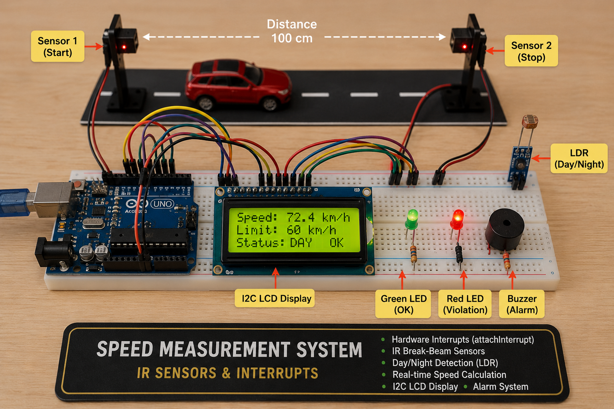

# Project 10 — Speed Measurement System: IR Sensors & Interrupts


## 1. What Are We Building?

We will build an **automatic vehicle speed detection system** — the same core principle
used in highway speed cameras and traffic management systems.

Two **IR break-beam sensors** are placed at a known distance apart on a road or
track. When a vehicle passes the **first sensor**, a precise timer starts. When it
passes the **second sensor**, the timer stops. Speed is calculated from distance
and elapsed time, then compared against a **speed limit** that automatically
adjusts for **day or night** (read from an LDR light sensor).

- ✅ **Green LED** — speed within the limit
- 🔴 **Red LED + Buzzer** — speed violation detected
- 🖥 **I2C LCD** — displays measured speed, limit, and day/night status

The highlight of this project is **`attachInterrupt()`** — the most precise timing
mechanism available on Arduino, which captures the exact microsecond a sensor
is triggered regardless of what else the program is doing.



---

## 2. What Will You Learn?

By the end of this project you will be able to:

- Explain what a **hardware interrupt** is and why it is fundamentally different
  from polling (`if (digitalRead(...))`)
- Use `attachInterrupt()`, `digitalPinToInterrupt()`, and choose the correct
  **trigger mode** (RISING, FALLING, CHANGE)
- Write an **ISR (Interrupt Service Routine)** and understand its strict constraints
- Use the **`volatile`** keyword for variables shared between an ISR and `loop()`

---

## 3. Components Needed

### Physical Build

| Quantity | Component | Notes |
|----------|-----------|-------|
| 1 | Arduino Uno | |
| 2 | IR break-beam sensor modules | Transmitter + receiver pairs; OUT goes LOW when beam is broken |
| 1 | LDR (photoresistor) | Light-dependent resistor for day/night detection |
| 1 | 10 kΩ resistor | Pull-down for LDR voltage divider |
| 1 | 16×2 I2C LCD | From Project 07 |
| 1 | Green LED + 220 Ω | Access OK indicator |
| 1 | Red LED + 220 Ω | Violation indicator |
| 1 | Passive buzzer | Violation alarm |
| 1 | Breadboard | |
| Several | Jumper wires | |


## 4. Key Concepts

### 4.1 The Problem with Polling

In every project so far, we checked sensor states by **polling** — repeatedly asking
"is the button pressed? Is the IR triggered?" inside `loop()`:

```cpp
void loop() {
  if (digitalRead(IR1_PIN) == LOW) {   // polling — checked ~every few ms
    t1 = millis();
  }
}
```

**The problem:** `loop()` is not always checking the sensor. Between readings there
is code running — `delay()` calls, LCD updates, Serial prints — which can take
milliseconds or even seconds. If a fast vehicle passes during that gap, the event
is **missed entirely**.

For a speed camera that must detect objects moving at 100+ km/h passing a 1 cm
sensor gap in under 0.36 ms — polling is completely inadequate.

### 4.2 Hardware Interrupts — The Solution

A **hardware interrupt** is a signal that temporarily **stops whatever the processor
is doing** and immediately runs a special function called an **ISR (Interrupt
Service Routine)**. After the ISR finishes, execution resumes exactly where it
left off.

```
Normal execution:              With interrupt:
─────────────────              ─────────────────────────────────────
loop() running...              loop() running...
  lcd.print(...)                 lcd.pri...  ← STOPPED
  delay(100)...                               ↓
  analogRead(...)              ISR runs immediately!
  ...                            t1 = millis();  ← captured precisely
                                             ↓
                               loop() resumes: ...nt(...)
```

The key advantage: **the ISR responds in microseconds**, regardless of what
`loop()` is currently doing — even in the middle of a `delay()`.

### 4.3 Interrupt Pins on Arduino Uno

Arduino Uno has **two external interrupt pins**:

| Pin | Interrupt Number | `digitalPinToInterrupt()` |
|-----|-----------------|--------------------------|
| **2** | INT0 | `digitalPinToInterrupt(2)` → 0 |
| **3** | INT1 | `digitalPinToInterrupt(3)` → 1 |

>[!NOTE] 
Always use `digitalPinToInterrupt(pin)` instead of hardcoding the interrupt
> number. It works correctly across all Arduino boards — pin 2 maps to interrupt
> 0 on Uno but may map differently on Mega or Leonardo.

### 4.4 `attachInterrupt()` — Registering an ISR

```cpp
attachInterrupt(digitalPinToInterrupt(pin), ISR_function, mode);
```

| Parameter | Options | Meaning |
|-----------|---------|---------|
| `pin` | 2 or 3 on Uno | Which pin to watch |
| `ISR_function` | your function name | Function to call when triggered |
| `mode` | `RISING` | Trigger when pin goes LOW → HIGH |
| | `FALLING` | Trigger when pin goes HIGH → LOW |
| | `CHANGE` | Trigger on any state change |
| | `LOW` | Trigger continuously while pin is LOW |

For our IR sensors (OUTPUT goes LOW when beam is broken):
```cpp
attachInterrupt(digitalPinToInterrupt(IR1_PIN), onSensor1, FALLING);
```

### 4.5 Writing an ISR — Strict Rules

An ISR is a regular-looking function, but with important constraints:

```cpp
void onSensor1() {
  t1 = millis();              // ✅ OK — millis() works inside ISR (incremented by timer hardware)
  sensor1Triggered = true;    // ✅ OK — set a flag
}
```

**What you MUST NOT do inside an ISR:**

| Forbidden | Why |
|-----------|-----|
| `delay()` | Uses timer interrupts — blocked during ISR |
| `Serial.print()` | Uses interrupts internally — will hang or corrupt output |
| `digitalWrite()` for long operations | ISRs must be as short as possible |
| Complex calculations | ISRs block all other interrupts while running |

**The ISR pattern for Arduino:**
1. Record the timestamp or set a flag inside the ISR (fast — one or two lines)
2. Do all the heavy work (printing, calculating, displaying) in `loop()`

### 4.6 The `volatile` Keyword

When a variable is modified inside an ISR and read in `loop()`, the compiler
may **optimize it away** — caching it in a CPU register and never re-reading
it from memory. The ISR updates memory, but `loop()` keeps seeing the old
cached value.

`volatile` tells the compiler: *"this variable can change at any time — always
read it fresh from memory, never cache it."*

```cpp
volatile unsigned long t1 = 0;      // ← volatile: ISR writes, loop() reads
volatile unsigned long t2 = 0;
volatile bool sensor1Triggered = false;
volatile bool sensor2Triggered = false;
```

>[!CAUTION] 
Any variable written inside an ISR and read outside it
> **must** be declared `volatile`. Forgetting this causes bugs that appear
> and disappear seemingly at random.

### 4.7 Speed Calculation

```
speed = distance / time
```

In our system:
- **Distance:** fixed gap between sensor 1 and sensor 2 (in real world: meters)
- **Time:** `t2 - t1` in milliseconds → convert to seconds (divide by 1000)
- **Speed unit:** meters/second → convert to km/h (multiply by 3.6)

```cpp
float timeSec  = (t2 - t1) / 1000.0;          // ms → seconds
float speedMs  = SENSOR_DISTANCE_M / timeSec;  // m/s
float speedKmh = speedMs * 3.6;               // m/s → km/h
```


### 4.8 LDR Voltage Divider for Day/Night Detection

The LDR's resistance changes with light. Paired with a fixed resistor in a
**voltage divider**, it produces a voltage that `analogRead()` can measure:

```
5V ──── [LDR] ──── A0 ──── [10kΩ] ──── GND
```

- **Bright (day):** LDR resistance low → voltage at A0 is **high** (closer to 5V)
- **Dark (night):** LDR resistance high → voltage at A0 is **low** (closer to 0V)

```cpp
int lightLevel = analogRead(LDR_PIN);   // 0–1023
bool isDay     = (lightLevel > LDR_THRESHOLD);
float limit    = isDay ? DAY_LIMIT_KMH : NIGHT_LIMIT_KMH;
```

---

### Pin Connections

| Component | Arduino Pin |
|-----------|------------|
| IR Sensor 1 → OUT | **2** (interrupt pin INT0) |
| IR Sensor 2 → OUT | **3** (interrupt pin INT1) |
| IR Sensor 1 & 2 → VCC | 5V |
| IR Sensor 1 & 2 → GND | GND |
| LDR (one leg) | A0 |
| LDR (other leg) | 5V |
| 10kΩ resistor (between A0 and GND) | A0 → GND |
| LCD SDA | A4 |
| LCD SCL | A5 |
| Green LED (+) | 220Ω → Pin 8 |
| Red LED (+) | 220Ω → Pin 9 |
| Buzzer (+) | Pin 10 |
| All (–) / GND | GND |


## 5. The Code

```cpp
#include <Wire.h>
#include <LiquidCrystal_I2C.h>

// ── Pin Definitions ──────────────────────────────────────────
const int IR1_PIN    = 2;    // INT0 — must be pin 2 or 3
const int IR2_PIN    = 3;    // INT1 — must be pin 2 or 3
const int LDR_PIN    = A0;
const int GREEN_LED  = 8;
const int RED_LED    = 9;
const int BUZZER_PIN = 10;

// ── Measurement Parameters ────────────────────────────────────
const float SENSOR_DISTANCE_M  = 3.0;    // real-world distance between sensors (m)
const float DAY_LIMIT_KMH      = 60.0;   // daytime speed limit
const float NIGHT_LIMIT_KMH    = 40.0;   // nighttime speed limit
const int   LDR_THRESHOLD      = 500;    // 0–1023; above = day, below = night
const unsigned long TIMEOUT_MS = 5000;   // reset if vehicle doesn't reach sensor 2 in 5 s

// ── Volatile ISR variables ─────────────────────────────────────
volatile unsigned long t1              = 0;
volatile unsigned long t2              = 0;
volatile bool          sensor1Triggered = false;
volatile bool          sensor2Triggered = false;

// ── State machine ──────────────────────────────────────────────
enum SystemState { IDLE, MEASURING, RESULT };
SystemState state = IDLE;

// ── LCD ───────────────────────────────────────────────────────
LiquidCrystal_I2C lcd(0x27, 16, 2);

// ═════════════════════════════════════════════════════════════
void setup() {
  Serial.begin(9600);
  Wire.begin();
  lcd.init();
  lcd.backlight();

  pinMode(IR1_PIN,    INPUT);
  pinMode(IR2_PIN,    INPUT);
  pinMode(GREEN_LED,  OUTPUT);
  pinMode(RED_LED,    OUTPUT);
  pinMode(BUZZER_PIN, OUTPUT);

  // ── Register ISRs ────────────────────────────────────────
  attachInterrupt(digitalPinToInterrupt(IR1_PIN), isr_sensor1, FALLING);
  attachInterrupt(digitalPinToInterrupt(IR2_PIN), isr_sensor2, FALLING);

  showIdle();
  Serial.println("=== Speed Measurement System Ready ===");
}

// ═════════════════════════════════════════════════════════════
void loop() {
  switch (state) {

    // ── IDLE: waiting for a vehicle to break sensor 1 ──────
    case IDLE:
      if (sensor1Triggered) {
        sensor1Triggered = false;
        state = MEASURING;

        lcd.clear();
        lcd.setCursor(0, 0);
        lcd.print("Vehicle detected");
        lcd.setCursor(0, 1);
        lcd.print("Measuring...");

        Serial.print("Sensor 1 triggered at: ");
        Serial.println(t1);
      }
      break;

    // ── MEASURING: sensor 1 passed, waiting for sensor 2 ───
    case MEASURING:
      // Check for sensor 2 trigger
      if (sensor2Triggered) {
        sensor2Triggered = false;
        state = RESULT;

        Serial.print("Sensor 2 triggered at: ");
        Serial.println(t2);
      }

      // Timeout: vehicle never reached sensor 2
      if (millis() - t1 > TIMEOUT_MS) {
        Serial.println("Timeout — vehicle did not reach sensor 2.");
        state = IDLE;
        sensor1Triggered = false;
        sensor2Triggered = false;
        showIdle();
      }
      break;

    // ── RESULT: both sensors triggered — calculate speed ────
    case RESULT: {
      float timeSec  = (t2 - t1) / 1000.0;
      float speedKmh = (SENSOR_DISTANCE_M / timeSec) * 3.6;

      bool  isDay = (analogRead(LDR_PIN) > LDR_THRESHOLD);
      float limit = isDay ? DAY_LIMIT_KMH : NIGHT_LIMIT_KMH;

      // Print to Serial Monitor
      Serial.print("Time: ");     Serial.print(timeSec, 3); Serial.println(" s");
      Serial.print("Speed: ");    Serial.print(speedKmh, 1); Serial.println(" km/h");
      Serial.print("Limit: ");    Serial.println(limit);
      Serial.print("Day/Night: "); Serial.println(isDay ? "Day" : "Night");

      // Display on LCD
      displayResult(speedKmh, limit, isDay);

      // Wait, then return to IDLE
      delay(4000);
      state = IDLE;
      showIdle();
      break;
    }
  }
}

// ── ISR for sensor 1 — KEEP IT SHORT ─────────────────────────
void isr_sensor1() {
  if (state == IDLE) {          // Only accept if we are waiting for a new vehicle
    t1 = millis();
    sensor1Triggered = true;
  }
}

// ── ISR for sensor 2 — KEEP IT SHORT ─────────────────────────
void isr_sensor2() {
  if (state == MEASURING) {     // Only accept if sensor 1 has already been triggered
    t2 = millis();
    sensor2Triggered = true;
  }
}

// ── Display speed result on LCD and drive LEDs/buzzer ─────────
void displayResult(float speedKmh, float limit, bool isDay) {
  lcd.clear();
  lcd.setCursor(0, 0);
  lcd.print("Speed:");
  lcd.print(speedKmh, 1);
  lcd.print("km/h");

  lcd.setCursor(0, 1);
  lcd.print(isDay ? "[D]" : "[N]");
  lcd.print(" Lim:");
  lcd.print(limit, 0);

  if (speedKmh > limit) {
    lcd.print(" OVER!");
    digitalWrite(RED_LED, HIGH);
    tone(BUZZER_PIN, 2000);
    delay(500); noTone(BUZZER_PIN);
    delay(200);
    tone(BUZZER_PIN, 2000);
    delay(500); noTone(BUZZER_PIN);
    digitalWrite(RED_LED, LOW);
    Serial.println(">>> VIOLATION DETECTED <<<");
  } else {
    lcd.print(" OK");
    digitalWrite(GREEN_LED, HIGH);
    delay(2000);
    digitalWrite(GREEN_LED, LOW);
  }
}

// ── Show idle / standby screen ────────────────────────────────
void showIdle() {
  bool  isDay = (analogRead(LDR_PIN) > LDR_THRESHOLD);
  float limit = isDay ? DAY_LIMIT_KMH : NIGHT_LIMIT_KMH;

  lcd.clear();
  lcd.setCursor(0, 0);
  lcd.print(isDay ? "[DAY]  " : "[NIGHT] ");
  lcd.print("Lim:");
  lcd.print(limit, 0);
  lcd.setCursor(0, 1);
  lcd.print("Waiting...");
}
```

---

### Why the ISR Checks `state`

```cpp
void isr_sensor1() {
  if (state == IDLE) {      // ← guard condition
    t1 = millis();
    sensor1Triggered = true;
  }
}
```

Without the state check, if sensor 1 is vibrating or has electrical noise,
it could re-trigger while we are already measuring — overwriting `t1` and
corrupting the measurement. The guard condition makes the ISR only record
data when the system is in the correct state to receive it.


---

## 6. Exercises & Challenges

### Exercise 1 — Serial Speed Log ⭐

Every time a speed measurement is completed, print a formatted log entry to the
Serial Monitor including a running measurement count:

```
[001] Time: 0.312 s | Speed: 34.6 km/h | Limit: 60 | Status: OK
[002] Time: 0.150 s | Speed: 72.0 km/h | Limit: 60 | Status: VIOLATION
```

*Hint: Use a global `int measurementCount = 0;` and increment it in the RESULT state.*

---

### Exercise 2 — Rolling Average ⭐⭐

Keep the **last 5 speed measurements** in an array and display the average speed
along with the latest reading on the LCD:

```
Speed: 72.0 km/h
Avg(5): 58.3 km/h
```

*Hint: Use a circular buffer — an array of 5 floats with an index that wraps around
using the `%` modulo operator.*

---

### Exercise 3 — Violation Counter with EEPROM ⭐⭐

Using what you learned in Project 07:
- Store a **total violation count** in EEPROM
- Increment it every time a violation is detected
- Display the all-time violation count on the LCD during idle:

```
[DAY] Lim:60
Wait | Viol:07
```

The count should survive a power cycle.

---

### Exercise 4 — Speed Categories ⭐⭐

Instead of a binary OK / VIOLATION response, define three severity levels:

| Category | Speed (vs limit) | LED | Buzzer |
|----------|-----------------|-----|--------|
| Safe | < 90% of limit | Green solid | Silent |
| Warning | 90–100% of limit | Green blinking | 1 short beep |
| Violation | > 100% of limit | Red solid | 2 long beeps |

---

### Exercise 5 — Wrong-Way Detection ⭐⭐⭐

If sensor 2 triggers **before** sensor 1 (vehicle travelling in the wrong direction),
display `"WRONG WAY!"` on the LCD and trigger a different alarm pattern.

*Hint: Modify `isr_sensor2()` to also handle the case where `state == IDLE` —
this means sensor 2 fired first.*

---

### Bonus Challenge — `micros()` for Higher Precision ⭐⭐⭐

`millis()` has 1 ms resolution. At 100 km/h, a vehicle travels 2.78 cm per millisecond.
For sensors 10 cm apart, the travel time is only ~3.6 ms — giving very few milliseconds
to work with and large percentage errors.

Replace `millis()` with **`micros()`** (microsecond resolution) throughout the ISRs
and speed calculation:

```cpp
volatile unsigned long t1 = 0;
void isr_sensor1() {
  if (state == IDLE) {
    t1 = micros();       // ← microseconds instead of milliseconds
    sensor1Triggered = true;
  }
}

// In RESULT state:
float timeSec = (t2 - t1) / 1000000.0;   // µs → seconds
```

Compare readings with `millis()` vs `micros()` at the same simulated timing.
How much does precision improve?

